# clawd-hud

Claude Code 的 mod：在输入框上方显示一行像素风用量条，带一只会跟着状态做动作的像素 Clawd。




- 上下文、5 小时额度、本周额度的格子进度条
- 5 小时额度的消耗速度，以及能不能撑到重置
- 本会话花费、上一轮的耗时、输出 token 和缓存命中率
- Clawd 跟着 Claude 的状态做动作：思考冒 `?`、调用工具敲锤子、写文件拿笔写字、读文件和搜索捧书看（读完想下一步时也继续捧着）、等你批准时举手、压缩上下文揉纸团、子代理干活时脚边跟着小 Clawd、有后台命令时脚边亮着小终端、写回复飘字、出错晕倒、中断摔倒、空闲睡觉、额度快用完时冒汗发抖、用完躺平

只在本地读取 Claude Code 已有的用量数据，不额外消耗 token。

桌面端的 Code 页面用 SVG 绘制。终端里用方块字符画同一套 Clawd（3 行高），动作和桌面端一一对应，进度条的逐格亮起、高光扫过、快满时闪烁也一样有。终端字符格比像素粗，细节会简化一些：身体始终对齐字符格，上下晃动改成腿伸缩，避免在 macOS 自带终端里出现横缝。

终端里的横条始终只占一行。宽度不够时依次收紧：缩小间距、缩短进度条、隐藏子代理和后台命令的小图标、去掉输出和缓存、去掉上轮和速度、Clawd 只留身体、去掉本会话和额度预测，最后才隐藏 Clawd。

## 安装

```bash
claude plugin marketplace add segfaultlab/clawd-hud
claude plugin install clawd-hud@clawd-hud
```

装好后新开一个会话就生效。

## 更新

建议打开自动更新：在终端里运行 `claude`，输入 `/plugin`，进入 Marketplaces，选中 clawd-hud，打开自动更新。之后有新版本时 Claude Code 会自己拉取，重启会话后生效。

不开自动更新的话，手动执行：

```bash
claude plugin marketplace update clawd-hud
claude plugin update clawd-hud@clawd-hud
```

5h 和 wk 两条来自订阅账号的额度数据，用 API key 登录时只显示 ctx。

## 本地开发

改代码时直接加载源码目录，不用安装：

```bash
claude --plugin-dir /path/to/clawd-hud
```

这时先在 `/plugin` 里停用已安装的 clawd-hud，否则会出现两条横条。终端会话会监视这个目录，保存后自动重新加载。

插件没有写版本号，每次提交到 GitHub 都算一个新版本。

改了画图代码后重新生成 README 里的图：

```bash
node scripts/preview.ts
```

## 文件

- `hooks/register.tsx`：事件钩子，读取用量、跟踪状态
- `hooks/draw.ts`：生成横条的 SVG（像素 Clawd、进度条、动画）
- `hooks/term.ts`：终端版的每一帧，用方块字符画 Clawd、进度条和缓存命中的小星星
- `types/index.d.ts`：mod 保存的状态类型
- `scripts/preview.ts`：生成 `docs/` 下的效果图
- `tests/band.test.tsx`：横条在终端和桌面端的渲染测试，用 `claude plugin test .` 运行
